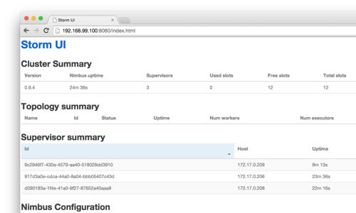

# siniida/storm

for gennai cluster. ([gennai.docker](https://github.com/siniida/gennai.docker))

## Require

### ZooKeeper

ex)

    $ docker run -d --name=zk siniida/zookeeper

use zookeeper/cluster.sh

    $ ../zookeeper/cluster.sh start 3
    $ ../zookeeper/cluster.sh status --link

## Nimbus

require `-e ROLE=nimbus`.

    $ docker run -d --name nimbus -e ROLE=nimbus --link zk:zk siniida/storm 

## Supervisor

require `-e ROLE=supervisor`.

    $ docker run -d -e ROLE=supervisor -e NIMBUS=nimbus --link zk:zk siniida/storm

## UI

require `-e ROLE=ui`.

    $ docker run -d -e ROLE=ui -e NIMBUS=nimbus --link zk:zk -p 8080:8080 siniida/storm

----

## Example

### 1. start ZooKeeper ensamble using cluster.sh.

    $ ../zookeeper/cluster.sh start

### 2. get ZooKeeper ensamble link string.

    $ ../zookeeper/cluster.sh status --link
    --link zk1:zk1 --link zk2:zk2 --link zk3:zk3

### 3. start Storm Nimbus

    $ docker run -d --name nimbus -e ROLE=nimbus --link zk1:zk1 --link zk2:zk2 --link zk3:zk3 siniida/storm

### 4. start Storm Supervisor x3

    $ docker run -d -e ROLE=supervisor -e NIMBUS=nimbus --link zk1:zk1 --link zk2:zk2 --link zk3:zk3 siniida/storm
    $ docker run -d -e ROLE=supervisor -e NIMBUS=nimbus --link zk1:zk1 --link zk2:zk2 --link zk3:zk3 siniida/storm
    $ docker run -d -e ROLE=supervisor -e NIMBUS=nimbus --link zk1:zk1 --link zk2:zk2 --link zk3:zk3 siniida/storm

### 5. check Znode

    $ docker run -ti --rm siniida/zookeeper /bin/bash
    [root@[ContainerID] zookeeper-3.4.6]# ./bin/zkCli.sh -server zk1:2181
    [zk: zk1:2181(CONNECTED) 0] ls /
    [storm, zookeeper]
    [zk: zk1:2181(CONNECTED) 1] ls /storm
    [workerbeats, errors, supervisors, storms, assignments]
    [zk: zk1:2181(CONNECTED) 2] ls /storm/supervisors
    [9c2946f7-430a-4579-aa40-518028dd3910, d090183a-1f4e-41a0-9f27-87652a40aaa9, 917d3a0e-cdca-44a0-8a04-bbb05407c43d]
    [zk: zk1:2181(CONNECTED) 3]

### 6. start Storm UI

    $ docker run -d -p 8080:8080 -e ROLE=ui -e NIMBUS=nimbus --link zk1:zk1 --link zk2:zk2 --link zk3:zk3 siniida/storm

### 7. Browser

Access to 8080 port on DockerHost.

